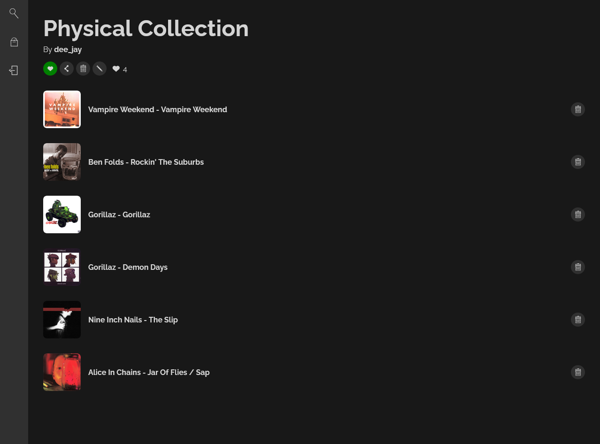

# Vinyl Shelf


## Table of Contents
- [About Vinyl Shelf](#about-vinyl-shelf)
- [Prerequisites](#prerequisites)
- [Installation](#installation)
- [Usage](#usage)
- [Screenshots](#screenshots)
- [Links](#links)
- [License](#license)


## About Vinyl Shelf
Vinyl Shelf is a PERN stack application that allows music enthusiasts to track and share their favorite albums. Authenticated users can create collections, known as shelves, and then discover albums they can add to their shelves through the application's search page. When the user searches for albums, the data is fetched from the Discogs API via the Disconnect package, and then sent back to users to be added to their respective shelves.

## Prerequisites

Please install the following tools before attempting installation and usage.

[Node.js v20.15](https://nodejs.org/en/download/prebuilt-installer)

[PostgreSQL v16](https://www.postgresql.org/download/)

Set up an developer account at Discogs, then create an app to obtain a consumer key and secret.

[Discogs API](https://www.discogs.com/developers/#page:authentication)

## Installation

Clone the repository.
```bash
git clone git@github.com:StaticCloud/Vinyl-Shelf.git
```

Navigate into the cloned repository.
```bash
cd Vinyl-Shelf
```

Run the install script.
```bash
npm run install
```

## Usage
Navigate into the cloned repository.
```bash
cd Vinyl-Shelf
```

Modify the `.env.EXAMPLE`. Change the connection string to include your PostgreSQL username, password, and database name. You will also need to provide a secret for JWT authentication, and your Discogs consumer key and consumer secret.
```bash
DATABASE_URL="postgresql://<username>:<password>@localhost:5432/<database>?schema=public"
SECRET="<secret for JWT signing>"

DISCOGS_CONSUMER_KEY="<discogs consumer key>"
DISCOGS_CONSUMER_SECRET="<discogs consumer secret>"
```

Remove the `.EXAMPLE` extension from the `.env.EXAMPLE` file.

Finally, navigate to the root directory and run the following command to concurrently run the server and the client.
```bash
npm run develop
```


## Screenshots

### Search Page


### User Profile


### Shelf


## Links

### [Link to deployed app.](https://vinyl-shelf.up.railway.app/)

## License

This project is licensed under the [MIT](https://github.com/StaticCloud/Vinyl-Shelf/blob/main/LICENSE) license.